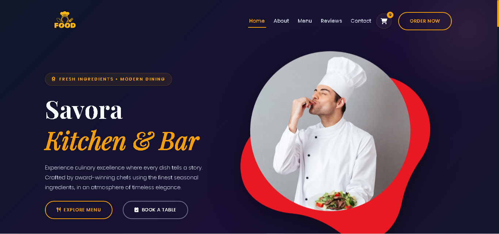
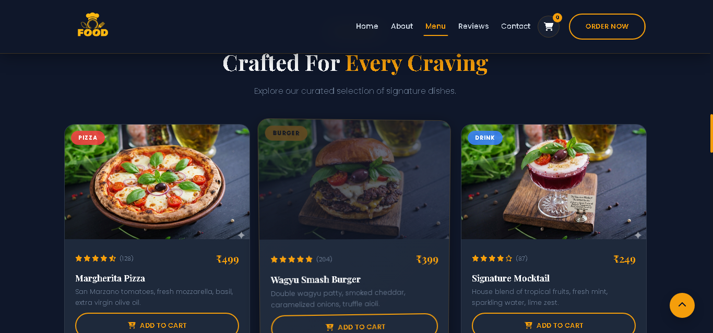
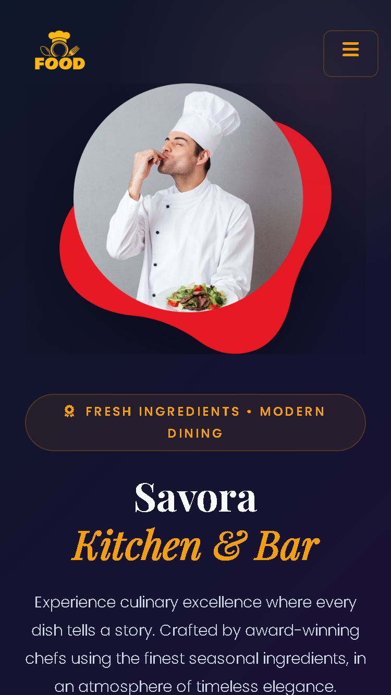

# Savora Kitchen & Bar 🍽️

A modern and responsive restaurant website built using HTML, CSS, JavaScript, and Bootstrap 5.  
This project showcases a clean restaurant landing page with smooth animations, interactive menu cards, reservation functionality, testimonials, and a modern UI design.

---

## 🚀 Features

- Responsive modern design
- Smooth scrolling navigation
- Animated hero section
- Interactive food menu cards
- Reservation form
- Testimonials section
- Shopping cart sidebar
- Scroll-to-top button
- Mobile-friendly layout
- Elegant dark theme UI

---

## 🛠️ Technologies Used

- HTML5
- CSS3
- JavaScript (ES6)
- Bootstrap 5
- Font Awesome
- AOS Animation Library

---

## 📂 Project Structure

```bash
savora-kitchen/
│
├── index.html
│
├── assets/
│   ├── css/
│   │   ├── style.css
│   │   └── responsive.css
│   │
│   ├── js/
│   │   └── app.js
│   │
│   └── images/
│       ├── hero/
│       ├── about/
│       ├── menu/
│       ├── testimonials/
│       └── branding/
│
├── preview/
│   ├── homepage-preview.png
│   ├── mobile-preview.png
│   └── menu-preview.png
│
├── README.md
├── LICENSE
├── CONTRIBUTING.md
└── .gitignore
```

---

## 📸 Desktop Preview




## 📱 Mobile Preview



---

## ⚙️ Installation

1. Clone the repository

```bash
git clone https://github.com/your-username/savora-kitchen.git
```

2. Open the project folder

```bash
cd savora-kitchen
```

3. Run the project

Simply open `index.html` in your browser.

---

## 🌐 Live Demo

Add your deployed project link here.

Example:

```bash
https://your-live-demo-link.com
```

---

## 📌 Future Improvements

- Backend integration
- Online food ordering system
- Authentication system
- Payment gateway integration
- Dark/Light mode toggle

---

## 👨‍💻 Author

Developed by Darshan Malgonvkar

---

## 📄 License

This project is licensed under the MIT License.